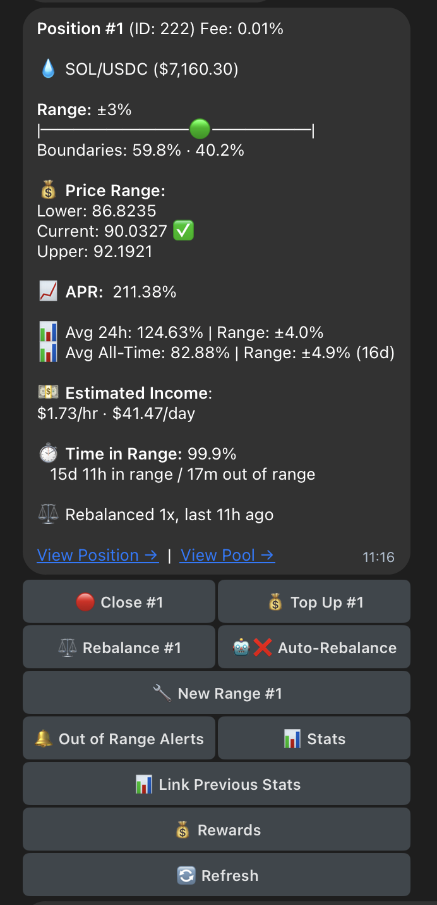
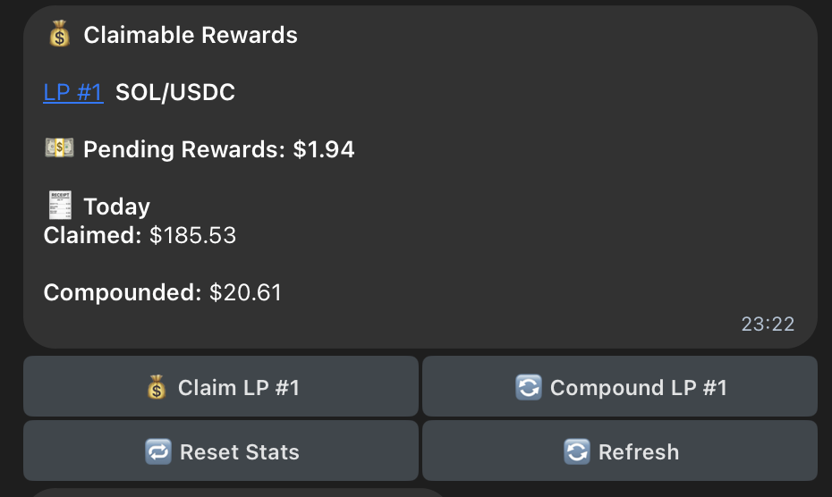
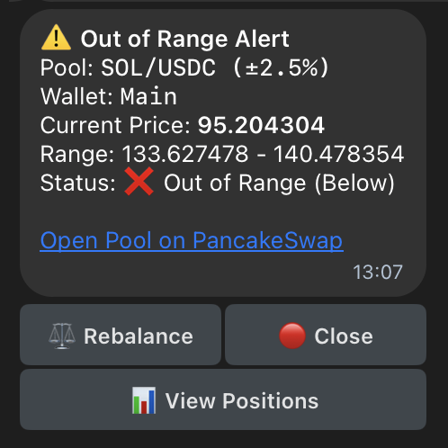
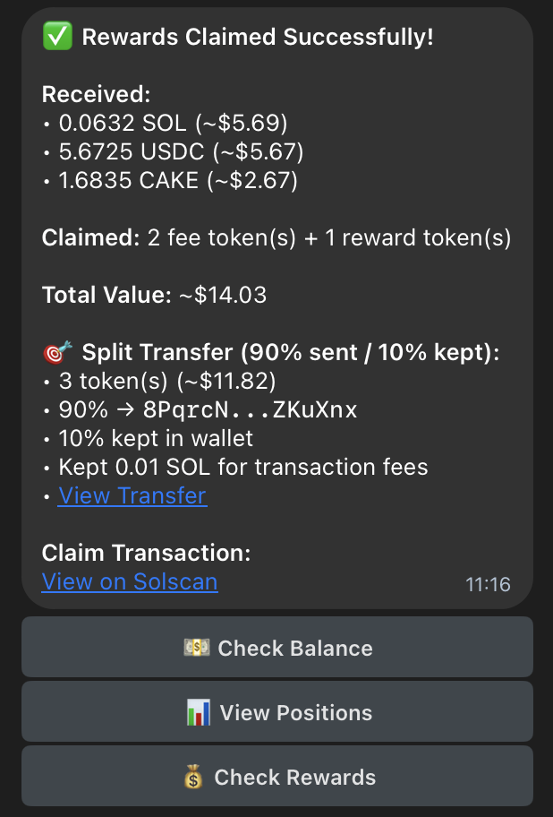

# PancakeSwap Autofarmer Bot — Solana

## + Uniswap Read-Only (Ethereum)

> **NOTE: This bot is experimental and unfinished.**
> - May have bugs
> - Use at your own risk

Telegram bot for automating PancakeSwap liquidity farming on Solana.

## Features

- Multi-wallet management (up to 3 wallets per user)
- Real-time position tracking with pool filtering
- Automated liquidity position creation and management
- Smart token swapping and auto-unwrap WSOL cleanup
- Real-time claimable rewards calculation and claiming
- Automated compounding
- Intelligent auto-rebalancing with volatility-adaptive ranges
- Manual position rebalancing for out-of-range positions
- Smart proximity alerts with edge-triggering
- Out-of-range notifications with rebalance buttons
- Visual range graphs and APR calculations
- Fee claim with optional distribution to a different wallet
- Secure private key encryption and export with auto-delete
- Security audit logging for all sensitive operations
- Read-only Uniswap v3 (Ethereum) position viewing/alerts

---

## Preview

| | |
| --- | --- |
|  |  |
| Position details with range, APR and value | Pending rewards across positions |
|  |  |
| Out-of-range alert with rebalance button | Rewards claim confirmation |

---

## Quick Start

### Prerequisites

- Node.js 18+
- pnpm (or npm)
- Telegram Bot Token (from [@BotFather](https://t.me/botfather))
- Helius RPC endpoint (free tier works, enables dynamic fees)

### 1. Install

```bash
cd autofarmer-sol
pnpm install
```

### 2. Setup

Generates `.env` and a secure `MASTER_PASSWORD`:

```bash
pnpm run setup
```

### 3. Configure

Edit `.env` and fill in the minimum required:

```bash
TELEGRAM_BOT_TOKEN=your_bot_token_here          # From @BotFather
TELEGRAM_ADMIN_ID=your_telegram_user_id         # From @userinfobot
SOLANA_RPC_URL=https://your-rpc-endpoint.com    # Helius recommended
MASTER_PASSWORD=...                             # Auto-set by setup
```

Recommended:

```bash
JUP_API=your_jupiter_api_key                    # https://portal.jup.ag/
MORALIS_API_KEY=your_moralis_key                # Token metadata
```

See [`docs/CONFIGURATION.md`](docs/CONFIGURATION.md) for the full list of variables, RPC/API notes, and database setup.

### 4. Run

```bash
pnpm run dev      # Development (auto-reload)
pnpm start        # Production
```

Open Telegram, find your bot, and send `/start`.

---

## Available Commands

### Wallet Management

- `/newwallet` — Generate new wallet
- `/importwallet` — Import from private key (Solana) or address (EVM read-only)
- `/exportkey` — Export private key (secure spoiler + auto-delete)
- `/wallet` — View active wallet
- `/wallets` — List all wallets
- `/balance` — Check SOL/ETH balance

### Position Management

- `/positions` — View all positions with pool filtering
- `/addposition` — Create new liquidity position
- `/rebalance <nft>` — Rebalance out-of-range position
- `/rewards` — Check claimable rewards
- `/claim` — Claim rewards
- `/compound` — Auto-compound rewards back into liquidity
- `/stats` — View aggregated stats

### Alerts & Monitoring

- `/proximity` — Configure proximity alerts (edge-triggered)

### Security

- `/auditlog` — View security audit log
- `/walletaudit` — View wallet security history

### Help

- `/help` — List all commands
- `/start` — Restart bot
- `/cancel` — Cancel current operation

---

## Documentation

| File | Purpose |
| --- | --- |
| [`docs/CONFIGURATION.md`](docs/CONFIGURATION.md) | Environment variables, database, API keys |
| [`docs/AUTO_REBALANCE.md`](docs/AUTO_REBALANCE.md) | Auto-rebalance strategy and configuration |
| [`docs/DEVELOPMENT.md`](docs/DEVELOPMENT.md) | Development guide and production deployment |
| [`docs/AUTO_REBALANCE_IMPLEMENTATION.md`](docs/AUTO_REBALANCE_IMPLEMENTATION.md) | Auto-rebalance implementation notes |
| [`docs/COMPOUND_FEATURE.md`](docs/COMPOUND_FEATURE.md) | Compound feature notes |
| [`docs/DRIZZLE_GUIDE.md`](docs/DRIZZLE_GUIDE.md) | Drizzle ORM usage |
| [`docs/CLAIM_TRACKING_ANALYSIS.md`](docs/CLAIM_TRACKING_ANALYSIS.md) | Claim tracking analysis |
| [`docs/REBALANCE_TRACKING.md`](docs/REBALANCE_TRACKING.md) | Rebalance tracking notes |
| [`docs/HELIUS-SWQOS-INTEGRATION-GUIDE.md`](docs/HELIUS-SWQOS-INTEGRATION-GUIDE.md) | Helius SWQOS integration |
| [`docs/SWQOS-IMPLEMENTATION-SUMMARY.md`](docs/SWQOS-IMPLEMENTATION-SUMMARY.md) | SWQOS implementation summary |

---

## License

MIT
